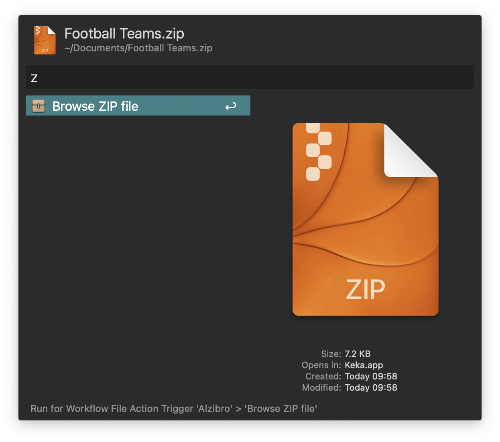
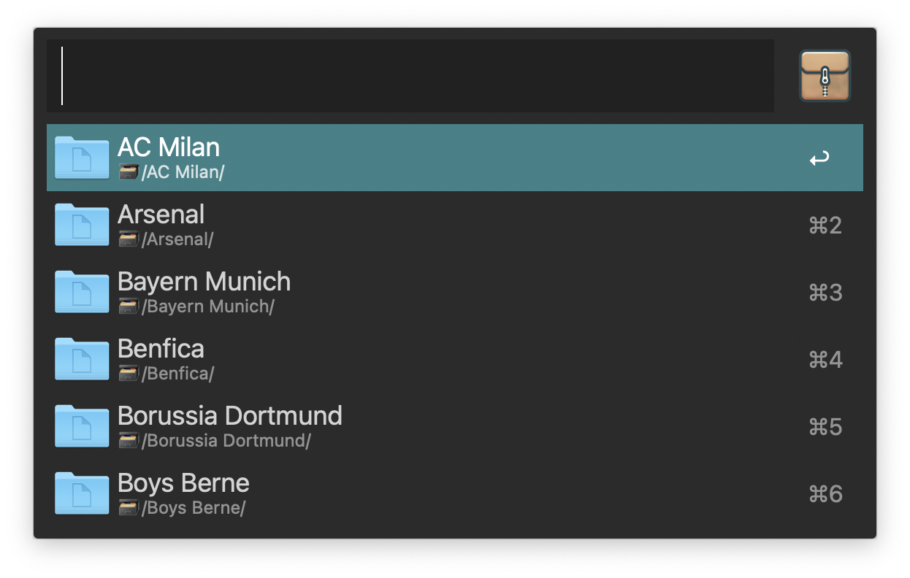
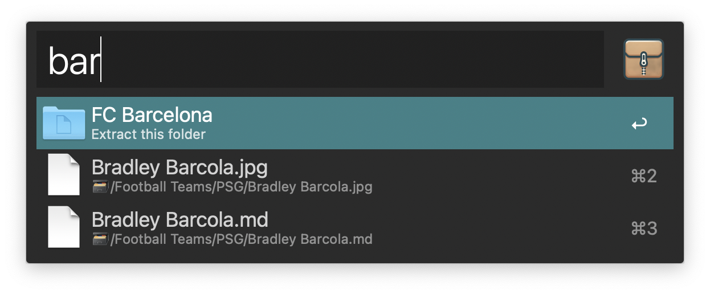

# Alzibro — A simple Alfred ZIP browser

## Introduction

Alzibro in an Alfred 5 workflow that allows browsing a ZIP file without fully opening it: navigate the hierarchy and extract individual files/folders.

## Usage

* Go to the configuration window to set options,
* Use the keyword (defined in the configuration) to call the workflow and then indicate the ZIP file,
  

  or:
* Apply the Universal Action 'Browse ZIP file' to a selected ZIP archive.
  

then

* Navigate with ↑, ↓, ↵ (open a folder) and ⇧↵ (go backwards in the hierarchy),

* Possibly search by name,

* Unzip a particular file/folder with ⌘↵.

## Remarks

* Alzibro does not modify the ZIP file in any way,
* It tries to recover macos' metadata (tags, etc.) together with the file.